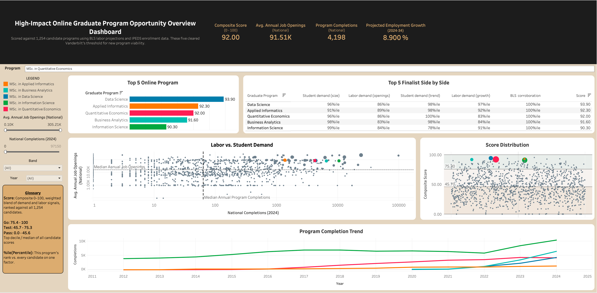

# Program Viability Assessment

**Which new online graduate program should Vanderbilt launch next?**

Every graduate field in the national completions data gets scored against student demand
and labor-market demand, checked against what Vanderbilt already offers online, and
sorted into a Go / Test / Pass verdict. 1,254 candidate fields in, five finalists out.

[Open the interactive dashboard on Tableau Public](https://public.tableau.com/app/profile/pranish.p7454/viz/OnlineProgramViabilityAssessment/Program_Overview_Dashboard2)

The written deliverables:

- [Feasibility report (PDF)](deliverables/phase5-feasibility-report.pdf), the full
  written recommendation with methodology and limitations
- [Presentation deck (PPTX)](deliverables/phase5-presentation-deck.pptx), 11 slides
- [Tableau workbook (TWBX)](deliverables/dashboard/OnlineProgramViabilityAssessment_v1.twbx),
  the packaged dashboard with its data extracts
- [`deliverables/`](deliverables/) for all of the above in one place

## The result

Five programs cleared every check. Scores are 0 to 100 composites built from five
weighted signals.

| Proposed program               | CIP code | Score |
| ------------------------------ | -------- | ----- |
| MSc. in Data Science           | 30.7001  | 93.9  |
| MSc. in Applied Informatics    | 11.0104  | 92.3  |
| MSc. in Quantitative Economics | 45.0603  | 92.0  |
| MSc. in Business Analytics     | 30.7102  | 91.6  |
| MSc. in Information Science    | 11.0401  | 90.3  |

Program names are proposals. Federal CIP titles are a statistical classification for
reporting and would never appear on a diploma, so each finalist was renamed against
Vanderbilt's own catalog conventions and checked for collisions with existing programs.
That check caught a real problem: a residential Data Science master's exists under a
different CIP code than the one this analysis matched on, which a pure code join would
have missed. Full reasoning in
[`docs/planning/phase3-finalist-program-naming-recommendations.md`](docs/planning/phase3-finalist-program-naming-recommendations.md).

## Methodology

The candidate universe is every CIP6 field of study in IPEDS national completions, all
1,268 of them, cross-referenced against BLS Employment Projections. The 14 fields
Vanderbilt already offers online are flagged and held out, leaving 1,254 to score.
Nothing was shortlisted by hand at any point.

**Joining student demand to labor demand.** IPEDS is keyed on CIP program codes and BLS
on SOC occupation codes, and the two do not share a code space. The official NCES
crosswalk bridges them, but the relationship is many-to-many: one field averages 2.8
matched occupations and can reach 180. The rule locked here takes each field's top 3
occupations by 2024 employment and combines their metrics with an employment-weighted
average, so a field's career breadth counts without letting a long tail of loose matches
dominate.

**Scoring.** Four continuous metrics plus one corroborating flag, weighted 30% current
completions, 30% job openings, 15% completions trend, 15% job growth, 10% appearance on
a BLS top-30 list. Normalization is percentile rank rather than min-max, because two
metrics are heavily right-skewed: Business Administration alone reports 97,150
completions against a median of 64.5, and min-max scaling would let that single field
define the top of the scale and crush everything else toward zero. Fields missing a
metric are scored on what they have, with the remaining weights rescaled, and a count of
how many metrics backed each score travels with it.

**Banding and shortlisting.** Cutoffs come from the real score distribution once it
existed: Go is the top decile (score ≥ 75.3), Test runs from the median up to that cutoff
(45.7 to 75.2), Pass falls below the median. That produces 126 Go, 502 Test, 626 Pass. Within the Go band, near-identical
CIP codes were grouped by shared title words and 4-digit CIP prefix, reducing 126 codes
to 61 distinct program ideas, 60 of which were ranked once the Nursing cluster was
excluded (see Limitations). Each group is ranked by its strongest single member, since
most clusters group genuinely different credentials and averaging would blur the
distinction the ranking exists to make.

Decisions, tradeoffs, and the data-quality problems found along the way:
[`docs/decisions-log.md`](docs/decisions-log.md).

## What's in this repo

| Path              | What lives here                                                                                    |
| ----------------- | -------------------------------------------------------------------------------------------------- |
| `data/raw/`     | Source tables as collected, never edited after collection                                          |
| `data/clean/`   | Analysis-ready tables, typed and standardized                                                      |
| `data/derived/` | The joined analysis mart and every downstream scoring and shortlist export                         |
| `scripts/`      | Collection, cleaning, and pipeline scripts                                                         |
| `sql/`          | Staging DDL, load, verification, scoring, banding, and shortlisting, numbered in run order         |
| `notebooks/`    | Independent verification of the scoring analysis, and the report figures                           |
| `deliverables/` | Tableau workbook, feasibility report PDF, presentation deck                                        |
| `docs/`         | Problem statement, provenance, decisions, data dictionary, ERD, glossary, and phase planning specs |

## Where to look

If you only open a few things, open these.

| File                                                                                              | Why open it                                                                                              |
| ------------------------------------------------------------------------------------------------- | -------------------------------------------------------------------------------------------------------- |
| [`docs/problem-statement.md`](docs/problem-statement.md)                                         | The question, what was in and out of scope, the role this models, and the independent-project disclaimer |
| [`docs/decisions-log.md`](docs/decisions-log.md)                                                 | Every methodology decision, plus the data-quality problems found and what was done about each            |
| [`docs/erd.md`](docs/erd.md)                                                                     | The data model as a rendered diagram: 14 tables from raw source through dashboard extract                |
| [`docs/data-sources.md`](docs/data-sources.md)                                                   | Provenance for every table, with pull dates and URLs, so any number can be traced back                   |
| [`sql/04_build_derived_candidates.sql`](sql/04_build_derived_candidates.sql)                     | The join that produces the analysis mart, with the reasoning in inline comments                          |
| [`notebooks/phase3_ai_report_verification.ipynb`](notebooks/phase3_ai_report_verification.ipynb) | Every number in the scoring findings recomputed from source data before the method was approved          |
| [`docs/planning/phase2-mart-design-spec.md`](docs/planning/phase2-mart-design-spec.md)           | The mart design written before any SQL, which the SQL then implements                                    |
| [`docs/working-with-ai.md`](docs/working-with-ai.md)                                             | Where AI assistance failed on this build, what it cost, and the checks that caught it                    |

New to the domain? [`docs/glossary.md`](docs/glossary.md) defines CIP, SOC, and the rest
in plain language. [`docs/data-dictionary.md`](docs/data-dictionary.md) profiles every
column in every table.

## Data sources

All public, all free.

- **BLS Employment Projections**, occupational demand, growth, and annual openings
- **IPEDS** via the datausa.io API, national completions by field, 2012 to 2024
- **NCES CIP to SOC crosswalk**, the official mapping between fields of study and occupations
- **Vanderbilt's online program catalog** and its Registrar CIP code list

Full provenance with pull dates and URLs: [`docs/data-sources.md`](docs/data-sources.md).

## Tools

**Analysis and data**
PostgreSQL 18 running locally for the whole SQL layer, Python with pandas for collection
and cleaning, matplotlib with numpy and scipy for the verification notebook and report
figures, openpyxl for the crosswalk workbook, and Tableau Public for the dashboard.
Mermaid renders the ERD natively on GitHub. The deck was generated with PptxGenJS and the
report PDF produced through LibreOffice.

**AI tooling**
Two surfaces, split by what each could reach. Cowork, a sandboxed Claude chat, ran one
conversation per phase for planning, analysis, and writing. Claude Code ran locally for
anything needing the network or the database: scraping, running scripts, executing SQL,
and git. The sandbox could not reach either, which is why the split existed.

Firecrawl did all the scraping: the BLS Employment Projections tables that feed the
analysis, peer-institution catalogs for the program-naming research, and Vanderbilt's
brand color palette for the report. NotebookLM ran an independent parallel read of two
data visualization books during the dashboard design phase, which is described in
[`docs/working-with-ai.md`](docs/working-with-ai.md).

**Evaluated and cut**
Google Trends was the originally planned search-interest signal. It failed a live
reachability test with an HTTP 429 and was dropped, along with the Google Trends MCP
that would have fed it. IPEDS multi-year completions already covered the same trend
signal, so nothing was lost. BigQuery was planned as the SQL warehouse and remains
parked. Qualtrics and R appear in the role posting this project models but were not used
here, since no survey data was collected and the analysis ran in SQL and Python.

## Limitations

- **Single university.** The method transfers; the numbers do not, without re-pulling another school's catalog.
- **Thin wage coverage.** Median pay exists for 60 of 832 occupations, too sparse to blend into the score, so it is used as a flag.
- **One generic occupation code inflates some scores.** SOC 11-1021, "General and Operations Managers," is large enough to lift several unrelated management-adjacent fields. Flagged per candidate, since excluding generic codes would need a defensible definition of "generic."
- **Vanderbilt's catalog data is incomplete for one program family.** Nursing was recorded as a single row instead of one row per specialty track, so the exclusion logic missed specialties already offered online. Caught at the shortlist stage and patched by excluding the whole cluster.
- **No primary research.** Every signal is public secondary data.
- **Nothing here is specific to Vanderbilt beyond the catalog subtraction.** The labor
  and completions data is public and national, so the same analysis would produce nearly
  the same shortlist for any university asking the question. The genuinely
  Vanderbilt-specific angle, which existing programs each finalist sits beside and what
  could share faculty or curriculum, needs institutional data this project does not have.
- **Percentile rank discards magnitude.** A field with a market three times larger scores
  the same as one that wins narrowly. That is the cost of being immune to the outliers
  described above, and it was accepted deliberately.
- **The band cutoffs are a convention applied to a smooth distribution.** The score
  distribution is smooth and roughly unimodal with no natural break anywhere, so top
  decile and median were used rather than an invented threshold. A field at 75.2 and one
  at 75.3 are not meaningfully different.
- **Scores rest on unequal amounts of evidence.** Fields missing a metric are scored on
  what they have. Four of the 126 Go candidates have no labor-market signal at all, and
  their Go status rests entirely on completions and the corroborating flag.
- **Trend windows are not comparable across fields.** IPEDS suppresses low-count cells,
  so each field's trend uses its own earliest and latest available year. One field's
  trend may span 13 years and another's 5. A further 126 candidates have no computable
  trend at all.
- **Two finalists, including the top-ranked one, have only 5 years of history.** Data
  Science and Business Analytics have no completions data before 2020, consistent with
  both being codes introduced in the CIP2020 revision. That explanation is likely rather
  than independently confirmed against an official source.
- **Every signal is national.** There is no Tennessee or Southeast cut anywhere in the
  pipeline, and regional demand can diverge from national.
- **The candidate universe is Master's level only**, by design of the original data pull.
- **Overlap detection is exact CIP6 match only.** A program Vanderbilt offers under a
  different but adjacent code is invisible to it, which is exactly how the residential
  Data Science master's was missed until the naming check caught it by hand.

The first four are worked through in full in
[`docs/decisions-log.md`](docs/decisions-log.md), including what it would take to fix the
two that were flagged instead of solved.

## Future scope

**Data and method**

- **Rebuild the Vanderbilt catalog at full granularity**, adding specialty tracks as
  individual CIP-coded rows, then rerun the pipeline. The most concrete item here, and
  the one that would retire a current limitation outright.
- **Competitor pricing**, benchmarking tuition and format against peer online programs.
  This was in the original problem statement and was cut for scope.
- **Exclude generic catch-all occupation codes from the join rule.** Doing it properly
  means defining what counts as too generic to trust, then rebuilding the mart rather
  than patching the affected rows. That definition was never scoped.
- **Map each finalist to the Vanderbilt school or college that would house it.** No
  school-level data exists in the project today, so this needs a small manual lookup.
- **Cluster across the full candidate set** rather than the Go band only.
- **A search-interest signal** such as Google Trends, as enrichment on the completions
  trend that already exists.
- **Port the SQL layer to BigQuery**, currently local Postgres.
- **Extend the method** beyond one university.

**Dashboard**

- **The Labor-Signal Corroboration filter.** One of two filters locked in the design
  spec and not built this pass. Toggles on the BLS top-30 flag that already feeds the
  score.
- **A caveat-flag filter** on the two data-quality flags, so a viewer can exclude
  candidates resting on a generic occupation code or on no labor data at all. Confirmed
  buildable from columns already in the mart; the only blocker is that they were never
  added to the Tableau extract.
- **A School or College filter**, which depends on the finalist-to-school mapping above.
- **Forecasting on the trend chart.** Tableau's native forecast was evaluated and
  declined, because two finalists have 5 years of history against 13 for the others and
  the feature draws every projection with equal apparent confidence. Revisit once the
  shorter series have more history.

## How AI was used, and where it went wrong

AI assistance did the mechanical work: scraping, parsing, cleaning, and drafting SQL.
Each script and query names the starter prompt behind it, and those prompts are collected
in [`docs/ai-prompts-log.md`](docs/ai-prompts-log.md). The design specs the SQL implements
were written first and live in `docs/planning/`, so the logic has a paper trail separate
from the code. Where AI-produced analysis fed a decision, the numbers were recomputed from
source data before the method was accepted, which is what
`notebooks/phase3_ai_report_verification.ipynb` does for the scoring model.

It also went wrong often enough to be worth documenting. A fuzzy-match script was
incorrect on 4 of the 11 CIP codes it was most confident about. A similarity threshold
chained 94 of 126 program titles into one false cluster. A field-type check was reported
as passing after looking at icon colors rather than the values on screen. A commit was
reported as done that `git status` showed had never happened.

[`docs/working-with-ai.md`](docs/working-with-ai.md) collects those incidents with the
numbers attached, along with the practices that caught them.

---

*Modeled on a Vanderbilt Office of the Deputy Provost Data
Analyst posting, using only public data.*
