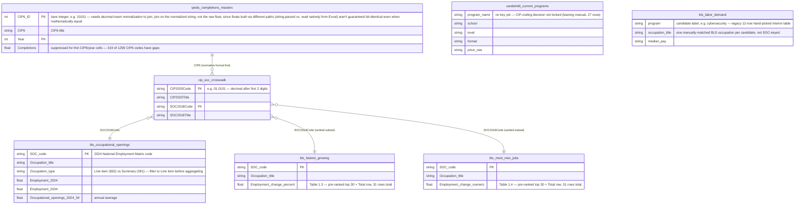

# Entity-Relationship Diagram — raw-data snapshot (2026-07-25)

*Preserved historical version. This is the ERD as it stood after Phase 2 EDA, documenting
`data/raw/` only, before any cleaning happened. Kept as-is for history — for the current
diagram (post-cleaning, with `vanderbilt_current_programs` keyed and joined in), see
`erd.md`.*

## What a junction/bridge table is

A junction (or bridge) table exists to connect two tables whose real-world relationship
is many-to-many — where a plain foreign key can't express it, because each row on one
side can match many rows on the other side, and vice versa. Instead of a direct link, both
tables point *into* the junction table, which stores one row per valid pairing.

`cip_soc_crosswalk` plays exactly this role here: a CIP6 academic program (e.g.
"Cybersecurity") typically maps to several SOC occupations (avg 2.8 SOC codes per CIP,
max 180), and a SOC occupation is typically fed by several CIP programs (avg 7 CIP codes
per SOC, max 337). Without the crosswalk, there'd be no principled way to connect IPEDS
completions data (CIP-keyed) to BLS labor-demand data (SOC-keyed).

## Diagram

## Notes (as of 2026-07-25, before cleaning)

- **`vanderbilt_current_programs`** has no key linking it into the chain above — the
  CIP-coding approach (manual vs. fuzzy match) wasn't locked yet at this point. Once
  coded, it'll join into `cip_soc_crosswalk` the same way `ipeds_completions_masters`
  does, and its role in the pipeline is to be *subtracted out* of the CIP universe
  (Vanderbilt already offers these — candidates are what's left).
- **`bls_labor_demand`** is the original 12-candidate hand-picked table from before the
  pivot to a fully data-derived candidate set. It's kept as-is for now as a first-pass
  sample to reconcile against the crosswalk-derived approach, not wired into the CIP↔SOC
  chain — its `program`/`occupation_title` values are free-text labels, not SOC/CIP codes.
- **`bls_fastest_growing`** and **`bls_most_new_jobs`** share the same SOC key space as
  `bls_occupational_openings` (all three come from the same BLS Employment Projections
  release) but are separate pre-ranked top-30 tables (Tables 1.3 and 1.4), not derived
  from `bls_occupational_openings` (Table 1.10) — hence three separate edges into
  `cip_soc_crosswalk` rather than one shared entity.
- **Not yet collected**: `competitors_pricing.csv` and `student_demand.csv` are stubbed
  in `data-sources.md` but no raw file exists yet, so they're omitted from the diagram
  until they land.
- **22 of 1,290 IPEDS CIP6 codes** have no match anywhere in the crosswalk (confirmed
  ultra-niche programs — Taxidermy, Talmudic Studies, etc.) — plan is to drop with a
  documented note rather than force a match.
