# Entity-Relationship Diagram

*All 6 source tables are cleaned (`data/clean/`) and joined into one analysis mart,
`derived_candidates`, built in Postgres per `sql/01` through `sql/05` (inline comments
carry the explanations). From there, `derived_candidates` feeds a chain of
scoring/shortlisting/dashboard-extract tables (`scored_candidates` through
`dashboard_completions_trend`, below) that now feed a published Tableau dashboard. This
is a living diagram, updated in place as the project progresses rather than versioned
per phase. An original raw-only diagram (before any cleaning) was kept as a historical
snapshot, filed privately alongside other retired working docs.*

*Note on field types below: `string`/`int`/`float` are Mermaid's conceptual field labels
for diagram readability, not literal pandas dtypes. Actual profiled dtypes (pandas
reports every text column as `object`, for example) are in `data-dictionary.md`.*

## What a junction/bridge table is

A junction (or bridge) table connects two tables whose real-world relationship is
many-to-many, where a plain foreign key can't express it, since each row on one side
can match many rows on the other side, and the reverse also holds. Instead of a direct
link, both tables point *into* the junction table, which stores one row per valid
pairing.

`cip_soc_crosswalk` plays exactly this role here: a CIP6 academic program (e.g.
"Cybersecurity") typically maps to several SOC occupations (avg 2.8 SOC codes per CIP,
max 180), and a SOC occupation is typically fed by several CIP programs (avg 7 CIP codes
per SOC, max 337). Without the crosswalk, there would be no principled way to connect
IPEDS completions data (CIP-keyed) to BLS labor-demand data (SOC-keyed).

## Diagram

```mermaid
erDiagram
    ipeds_completions_masters {
        int CIP6_ID PK "bare integer, e.g. 10101, needs decimal-insert normalization to join; join on the normalized string, not the raw float, since floats built via different paths (string-parsed vs. read natively from Excel) aren't guaranteed bit-identical even when mathematically equal"
        string CIP6 "CIP6 title"
        int Year PK
        float Completions "suppressed for thin CIP6/year cells, 319 of 1290 CIP6 codes have gaps"
    }

    cip_soc_crosswalk {
        string CIP2020Code FK "e.g. 01.0101, decimal after first 2 digits"
        string CIP2020Title
        string SOC2018Code FK
        string SOC2018Title
    }

    bls_occupational_openings {
        string SOC_code PK "2024 National Employment Matrix code"
        string Occupation_title
        string Occupation_type "Line item (832) vs Summary (281); filter to Line item before aggregating"
        float Employment_2024
        float Employment_2034
        float Occupational_openings_2024_34 "annual average"
    }

    bls_fastest_growing {
        string SOC_code PK
        string Occupation_title
        float Employment_change_percent "Table 1.3, pre-ranked top 30 plus Total row, 31 rows total"
    }

    bls_most_new_jobs {
        string SOC_code PK
        string Occupation_title
        float Employment_change_numeric "Table 1.4, pre-ranked top 30 plus Total row, 31 rows total"
    }

    vanderbilt_current_programs {
        string program_name "15 rows: Master's plus Doctorate only, 12 certificates dropped since they aren't standalone programs"
        string school
        string level
        string format
        float total_price_estimated "parsed from price_raw; 4/15 missing (unparseable or NR)"
        float cip2020_code FK "13/15 from Vanderbilt's official Registrar CIP list, 2/15 from the algorithmic shortlist"
        string cip2020_code_source "official vs. algorithmic, see docs/decisions-log-detailed.md"
    }

    bls_labor_demand {
        string program "candidate label, e.g. cybersecurity, a legacy 12-row hand-picked interim table"
        string occupation_title "one manually-matched BLS occupation per candidate, free text rather than SOC-keyed"
        string median_pay
    }

    derived_candidates {
        float cip2020_code PK "same code space as ipeds_completions_masters, 1,268 rows, one per candidate"
        string cip2020_title
        int latest_year
        float completions_latest_year
        int trend_earliest_year
        float completions_trend_pct "NULL for 126 rows, single-year CIPs with an unknown trend rather than a real 0 percent"
        string matched_soc_codes "top-3 by employment; NULL for 77 rows with no labor-market match at all"
        int n_socs_used "0-3"
        float employment_weighted_openings
        float employment_weighted_growth_pct
        string in_bls_top30_flag "a bonus signal only; wages are never blended in, since only 60 of 832 SOCs have wage data"
        string already_offered_by_vanderbilt "14 of 1268 rows TRUE; flagged, kept in place"
    }

    scored_candidates {
        float cip2020_code PK "same code space as derived_candidates"
        float score "0-100 composite, percentile-rank normalized"
        string band "Go / Test / Pass; NULL for the 14 already-offered rows"
    }

    shortlist_review {
        float cip2020_code PK "126 rows, the Go band only"
        boolean has_soc_11_1021 "generic-occupation caveat"
        boolean no_labor_data "zero labor-market signal caveat"
    }

    shortlist_review_clustered {
        float cip2020_code PK "same 126 rows, adds cluster assignment"
        string algo_cluster_id "27 multi-member clusters plus 34 singles"
    }

    shortlist_ranked {
        string cip2020_code PK "60 rows, one per cluster/single, cluster-1 (Nursing) excluded"
        float score "cluster's max-scoring member"
    }

    dashboard_population {
        float cip2020_code PK "1,254 rows, the full Go/Test/Pass population"
        boolean is_finalist "5 rows TRUE"
    }

    dashboard_completions_trend {
        float cip2020_code PK "49 of 65 expected rows; 2 finalists have no data before 2020"
        int year PK
    }

    ipeds_completions_masters ||--o{ cip_soc_crosswalk : "CIP6 (normalize format first)"
    vanderbilt_current_programs ||--o{ cip_soc_crosswalk : "cip2020_code, subtracted out of the candidate universe as a catalog check, not a demand signal"
    cip_soc_crosswalk }o--|| bls_occupational_openings : "SOC2018Code"
    cip_soc_crosswalk }o--|| bls_fastest_growing : "SOC2018Code (ranked subset)"
    cip_soc_crosswalk }o--|| bls_most_new_jobs : "SOC2018Code (ranked subset)"
    ipeds_completions_masters ||--|| derived_candidates : "base table, every CIP gets exactly one row"
    cip_soc_crosswalk }o--|| derived_candidates : "top-3 SOC by employment feed the weighted metrics"
    vanderbilt_current_programs ||--|| derived_candidates : "already_offered_by_vanderbilt flag"
    derived_candidates ||--|| scored_candidates : "same grain, adds the composite score and band"
    scored_candidates ||--o| shortlist_review : "Go band only (126 of 1,254 scored rows)"
    shortlist_review ||--|| shortlist_review_clustered : "adds algo_cluster_id via a Python clustering script, not SQL"
    shortlist_review_clustered }o--|| shortlist_ranked : "one ranked row per cluster (max-scoring member)"
    scored_candidates ||--o{ dashboard_population : "Go/Test/Pass population, Tableau extract"
    derived_candidates ||--o{ dashboard_completions_trend : "completions history for the 5 finalists, Tableau extract"
```

## Notes

- **`vanderbilt_current_programs`** now has its `cip2020_code` key (see
  [`docs/decisions-log.md`](decisions-log.md)) and joins into `cip_soc_crosswalk` the
  same way `ipeds_completions_masters` does. Its role in the pipeline is to be
  *subtracted out* of the CIP universe: Vanderbilt already offers these, so the
  candidates are what's left. 13 of 15 codes came from Vanderbilt's own official
  Registrar CIP list (`docs/planning/CIP_Codes.pdf`); the other 2 came from an
  algorithmic word-overlap shortlist (`scripts/suggest_vanderbilt_cip_codes.py`), since
  the official list doesn't cover them.
- **`bls_labor_demand`** is the original 12-candidate hand-picked table from before the
  pivot to a fully data-derived candidate set. It's kept as-is as a first-pass sample
  to reconcile against the crosswalk-derived approach; its `program`/`occupation_title`
  values are free-text labels, not SOC/CIP codes, so it isn't wired into the CIP↔SOC
  chain.
- **`bls_fastest_growing`** and **`bls_most_new_jobs`** share the same SOC key space as
  `bls_occupational_openings` (all three come from the same BLS Employment Projections
  release) but are separate pre-ranked top-30 tables (Tables 1.3 and 1.4). They aren't
  derived from `bls_occupational_openings` (Table 1.10), which is why they get three
  separate edges into `cip_soc_crosswalk` rather than one shared entity.
- **Cut entirely, not deferred**: `competitors_pricing.csv` and `student_demand.csv`
  were dropped for this project's scope, with no raw file for either and none planned.
  Omitted from the diagram.
- **22 of 1,290 IPEDS CIP6 codes** have no match anywhere in the crosswalk (confirmed
  ultra-niche programs: Taxidermy, Talmudic Studies, etc.), dropped with a documented
  note.
- **12 of 832 BLS SOC codes** (the "Line item" detail occupations) also have no
  crosswalk match. 7 are "broad group" codes the crosswalk instead maps at a more
  detailed sub-code level (e.g. `31-1120` maps to `31-1121`/`31-1122`); the other 5 are
  genuine small gaps. Same treatment: dropped with a documented note.
- **`derived_candidates`** is the analysis mart (Phase 2's final step; the SQL
  analysis/scoring phase starts from it). It's a CTE-built table in Postgres that
  aggregates each CIP's top-3 matched SOCs into a weighted score, more involved than
  the simple foreign-key joins the edges above represent. Those three edges are a
  simplification for readability; the real logic (window functions, weighted averages,
  `LEFT JOIN`s that preserve CIPs with no labor match) is in
  `sql/04_build_derived_candidates.sql`, walked through in that file's own inline
  comments. This table is the scoring step's input; the score itself lives on
  `scored_candidates`, below.
- **Everything downstream of `derived_candidates`** (`scored_candidates` through the
  two dashboard extracts) is scoring/shortlisting output on top of the mart, added so
  the diagram covers the full pipeline rather than stopping at the Phase 2 boundary.
  Same simplification as above: these are mostly one-to-one derivations off the mart
  (one row in, one row out, sometimes filtered to a subset), not new joins against
  outside data. Full column detail and grain for each lives in `data-dictionary.md`'s
  Analysis Marts section.
- **These six source tables also exist as real tables in a local Postgres database**
  (`program_viability`, port 5433), with enforced types (`NUMERIC(7,4)` for
  `cip2020_code`, matching the float-precision concern raised in this diagram) and
  primary keys that guarantee each table's documented grain. DDL:
  `sql/01_create_tables.sql`.
