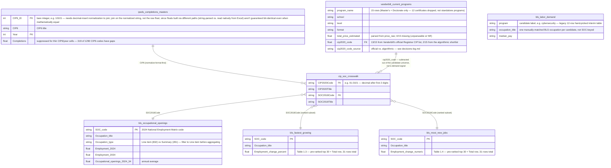

# Entity-Relationship Diagram

*Updated 2026-08-01. All 6 tables are now cleaned (`data/clean/`) and `vanderbilt_current_programs`
has its `cip2020_code` key assigned — this diagram reflects the post-cleaning keys and
grain, ahead of the join/derive step (Phase 2.2, still pending). For the original
raw-only diagram (before any cleaning), see `erd-raw-snapshot.md` — kept separately, not
overwritten.*

*Note on field types below: `string`/`int`/`float` are Mermaid's conceptual field labels
for diagram readability, not literal pandas dtypes. Actual profiled dtypes (e.g. pandas
reports every text column as `object`, not `string`) are in `data-dictionary.md`.*

## What a junction/bridge table is

A junction (or bridge) table exists to connect two tables whose real-world relationship
is many-to-many — where a plain foreign key can't express it, because each row on one
side can match many rows on the other side, and vice versa. Instead of a direct link, both
tables point *into* the junction table, which stores one row per valid pairing.

`cip_soc_crosswalk` plays exactly this role here: a CIP6 academic program (e.g.
"Cybersecurity") typically maps to several SOC occupations (avg 2.8 SOC codes per CIP,
max 180), and a SOC occupation is typically fed by several CIP programs (avg 7 CIP codes
per SOC, max 337). Without the crosswalk, there'd be no principled way to connect IPEDS
completions data (CIP-keyed) to BLS labor-demand data (SOC-keyed).

## Diagram

## Notes

- **`vanderbilt_current_programs`** now has its `cip2020_code` key (locked and assigned
  2026-08-01 — see [`decisions-log.md`](decisions-log.md)) and joins into
  `cip_soc_crosswalk` the same way `ipeds_completions_masters` does. Its role in the
  pipeline is to be *subtracted out* of the CIP universe (Vanderbilt already offers
  these — candidates are what's left). 13 of 15 codes came from Vanderbilt's own
  official Registrar CIP list (`planning/CIP_Codes.pdf`); the other 2 came from an
  algorithmic word-overlap shortlist (`scripts/suggest_vanderbilt_cip_codes.py`) since
  the official list doesn't cover them.
- **`bls_labor_demand`** is the original 12-candidate hand-picked table from before the
  pivot to a fully data-derived candidate set (2026-07-24 decisions-log entry). It's kept
  as-is for now as a first-pass sample to reconcile against the crosswalk-derived
  approach, not wired into the CIP↔SOC chain — its `program`/`occupation_title` values
  are free-text labels, not SOC/CIP codes.
- **`bls_fastest_growing`** and **`bls_most_new_jobs`** share the same SOC key space as
  `bls_occupational_openings` (all three come from the same BLS Employment Projections
  release) but are separate pre-ranked top-30 tables (Tables 1.3 and 1.4), not derived
  from `bls_occupational_openings` (Table 1.10) — hence three separate edges into
  `cip_soc_crosswalk` rather than one shared entity.
- **Cut, not just deferred**: `competitors_pricing.csv` and `student_demand.csv` were
  dropped entirely for this project's deadline (2026-08-01 decision in
  [`decisions-log.md`](decisions-log.md)), not merely postponed — no raw file exists for
  either, and none is planned before the screening call. Omitted from the diagram.
- **22 of 1,290 IPEDS CIP6 codes** have no match anywhere in the crosswalk (confirmed
  ultra-niche programs — Taxidermy, Talmudic Studies, etc.) — dropped with a documented
  note rather than forced.
- **12 of 832 BLS SOC codes** (the "Line item" detail occupations) also have no
  crosswalk match — 7 are "broad group" codes the crosswalk instead maps at a more
  detailed sub-code level (e.g. `31-1120` → `31-1121`/`31-1122`), the other 5 are
  genuine small gaps. Same treatment: dropped with a documented note.
